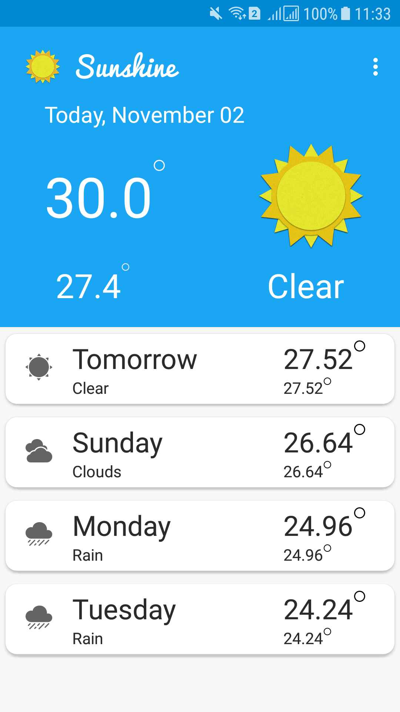

# TheWeatherApplication
This is a simple application for weather

#Note
- I am using Openweathermap API to get weather information
	* https://openweathermap.org/api
	- Get information by geographic coordinates
		Description:
		- Get weather forecast for 5 days with data every 3 hours by geographic coordinates.
		- API call:
		- api.openweathermap.org/data/2.5/forecast?lat={lat}&lon={lon}
		Parameters:
		- lat, lon coordinates of the location of your interest
		
	For Example : 
	
	http://api.openweathermap.org/data/2.5/forecast?appid=5098ae28de31c56c872d61b9153dee3d&units=metric&lat=16.07&lon=108.21
	
	In array list :
	
	- index : 0 -> today (current day)
	
		- Get comparator string from ("dt_txt": "2018-11-02 06:00:00") -> result strCheck = "06:00:00"
		
	From index 1 to end :
	
		- Get all object
		
			if(dt_txt.contains(strCheck))
			
				add to list
				
#Function 
- Overview screen

- Details screen 

- Extra
	- Share weather information
	- Setting location which user want to customize 
	

